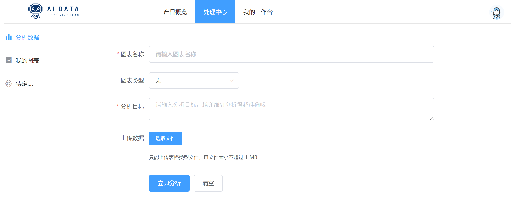

## 一、产品概述

#### 1、什么是智能 DA 平台

**智能 DA 平台**是一个 **基于 Vue 前端框架 **和 **Spring  Boot 后端框架** 融合当下热门的 **AI 能力 **构建的 **综合性数据分析工具**。该平台致力于为用户提供 **高效、便捷的数据处理** 与 **可视化服务**，帮助用户**轻松应对复杂的数据分析需求**。通过智能DA平台，用户可以 **上传表格文件**、**描述分析需求**、**指定可视化方向**，平台将自动过滤空数据，进行必要的数据清洗与预处理，进而实现自动化的**数据可视化**，让用户更加直观地了解数据背后的规律与趋势。

#### 2、智能DA平台的基础能力

1. **数据上传与解析**：智能DA平台支持多种格式的表格文件上传，包括Excel、CSV等。平台能够自动识别文件格式，并对其进行高效解析，提取出数据内容。
2. **数据清洗与预处理**：平台内置了丰富的数据清洗规则，能够自动检测并过滤掉空数据、重复数据等无效信息。同时，平台还提供了数据转换、标准化等功能，帮助用户将原始数据转化为适合分析的形式。
3. **数据可视化**：智能DA平台支持多种数据可视化方式，包括折线图、柱状图、饼图等。用户可以根据需要选择合适的可视化类型，平台将自动生成美观、易懂的图表，帮助用户快速把握数据特点。
4. **交互与分析**：平台不仅提供了强大的数据交互功能，还通过集成先进的生产式AI能力，为用户带来了前所未有的分析体验。用户可以通过简单的操作，与数据进行深度互动，探索数据背后的故事。同时，平台利用AI算法，自动为用户识别数据中的关键模式和趋势，提供精准的数据分析建议，帮助用户快速洞察业务状况，做出明智的决策。

#### 3、产品应用场景

1. **商业分析**：智能DA平台可广泛应用于商业领域，帮助企业分析销售数据、用户行为等关键信息，从而制定更加精准的市场策略。

2. **教育科研**：在教育科研领域，平台可用于处理实验数据、学生成绩等，帮助教育工作者更加直观地了解教学效果，优化教学方法。

3. **政府决策**：政府部门可以利用智能DA平台对各类社会数据进行统计分析，为政策制定提供科学依据，提高决策效率。

4. **个人数据管理**：对于个人用户而言，智能DA平台也是一个理想的个人数据管理工具，可以帮助用户整理和分析个人财务、健康等数据，提升生活质量。

   

## 二、快速上手

填写并提交该页面的内容，即可完成对图表数据的分析。具体分析结果可在 **我的图表** 页面中查看

## 三、平台功能

#### 1、登录与注册

使用本产品的任何功能都需要登录账号，如果没有账号请先注册。

注册时账号是您的唯一的凭证，不可重复

密码位数不能少于 8 位，请仔细核对。目前暂不支持修改账号和密码，请保管好您的密码。

#### 2、分析数据

在此界面您可以进行图表的创建和分析

| 项目     | 必填 | 描述                                                         |
| -------- | ---- | ------------------------------------------------------------ |
| 图标名称 | 是   | 用于标识不同图表，可以输入任意字符，但不超过100个字符        |
| 图表类型 | 否   | 通过选取图表类型来进行指定类型的可视化，若不选则系统会自动根据最优情况自行作图 |
| 分析目标 | 是   | 描述您的可视化要求、背景需求等相关内容，进行更精确的分析     |
| 文件上传 | 是   | 目前支持的上传的文件的类型仅为表格（xlxs、csv等）, 且文件大小不能超过 1MB |

#### 3、我的图表

在此界面您可以查看、编辑、删除目前已创建的图表，且支持通过图表名称的模糊查询进行图表筛选

​	ps：处于下图加载中状态说明图表正在分析，请耐心等待哦

点击图表能查看该图表的详细信息，如分析结论、可视化结果、创建时间、修改时间等

点击编辑按钮能对已经分析好的图表信息进行修改

点击删除按钮能对不想要的图表进行删除，**此操作不可逆**